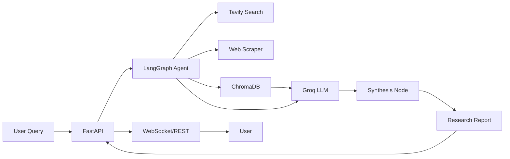

# 🤖 AI Research Agent - Production-Ready

[](https://cloud.google.com/run)
[](https://opensource.org/licenses/MIT)
[](https://www.python.org/downloads/)

**Production-grade AI research agent** built with LangGraph, RAG, and deployed on Google Cloud Run. Performs comprehensive web research, scrapes and analyzes content, and generates detailed reports with citations.

🔗 **[Live Demo](https://your-deployment-url.run.app/docs)** | 📖 **[Documentation](./DEPLOYMENT.md)** | 🎥 **[Demo Video](#)**

---

## 🚀 Features

### Core Capabilities
- 🔍 **Multi-stage Research Pipeline** - Automated search → scrape → synthesize workflow
- 🧠 **RAG-Powered Synthesis** - Retrieval-Augmented Generation using ChromaDB vector store  
- 📊 **Semantic Search** - Local embeddings (all-MiniLM-L6-v2) for context retrieval
- 💬 **Streaming Responses** - Real-time results via WebSocket
- 🗃️ **Conversation Memory** - Redis-backed session storage

### Production Features
- ⚡ **Auto-scaling** - Serverless deployment on Cloud Run (0→N instances)
- 📈 **Observability** - Structured logging + Prometheus metrics
- 🔒 **Security** - Rate limiting, input validation, CORS, optional API key auth
- 🚦 **CI/CD** - Automated testing and deployment via GitHub Actions
- 📚 **OpenAPI Docs** - Interactive Swagger UI at `/docs`
- 🧪 **Tested** - 70%+ code coverage with pytest

---

## 🏗️ Architecture



**Tech Stack:**
- **LLM**: Groq (Llama-3.3-70b-versatile) - FREE & Fast
- **Embeddings**: HuggingFace all-MiniLM-L6-v2 (local, no API cost)
- **Vector DB**: ChromaDB (persistent storage)
- **Search**: Tavily API
- **Framework**: LangChain + LangGraph
- **API**: FastAPI (async, WebSocket support)
- **Deployment**: Docker + Railway

---

## 📦 Quick Start

### Local Development

```bash
# Clone repo
git clone https://github.com/yourusername/ai-research-agent.git
cd ai-research-agent

# Create virtual environment
python -m venv venv
source venv/bin/activate  # Windows: venv\Scripts\activate

# Install dependencies
pip install -r requirements.txt

# Configure environment variables
cp .env.example .env
# Edit .env and add your API keys:
# - GROQ_API_KEY (free from console.groq.com)
# - TAVILY_API_KEY (free from app.tavily.com)

# Run server
uvicorn src.api.main:app --reload

# Visit API docs
open http://localhost:8000/docs
```

### Docker

```bash
docker-compose up --build
```

### Production Deployment

See **[DEPLOYMENT.md](./DEPLOYMENT.md)** for complete Railway deployment guide.

---

## 🎮 Usage

### REST API

```python
import requests

response = requests.post(
    "http://localhost:8000/research",
    json={
        "query": "What are the latest advances in RAG for LLMs?",
        "max_results": 5
    }
)
print(response.json())
```

### WebSocket (Streaming)

```python
import asyncio
import websockets
import json

async def stream_research():
    uri = "ws://localhost:8000/ws/research"
    async with websockets.connect(uri) as websocket:
        await websocket.send(json.dumps({
            "query": "Explain transformer architecture",
            "session_id": "user123"
        }))
        
        async for message in websocket:
            data = json.loads(message)
            print(data.get("content", ""))

asyncio.run(stream_research())
```

### Streamlit Frontend

```bash
streamlit run frontend/app.py
```

---

## 📊 API Endpoints

| Endpoint | Method | Description |
|----------|--------|-------------|
| `/health` | GET | Health check |
| `/research` | POST | Execute research query |
| `/ws/research` | WebSocket | Streaming research |
| `/docs` | GET | Interactive API docs |
| `/metrics` | GET | Prometheus metrics |

**Request Example:**
```json
{
  "query": "What is RAG in AI?",
  "max_results": 3,
  "session_id": "optional-session-id"
}
```

**Response Example:**
```json
{
  "query": "What is RAG in AI?",
  "report": "Comprehensive research report with citations...",
  "sources": [
    {"url": "...", "title": "..."},
  ],
  "metadata": {
    "processing_time": 12.5,
    "chunks_retrieved": 15
  }
}
```

---

## 🧪 Testing

```bash
# Run all tests
pytest tests/ -v --cov=src

# Run specific test file
pytest tests/test_agent.py -v

# Run with coverage report
pytest --cov=src --cov-report=html
```

---

## 📈 Monitoring

**Included metrics** (available at `/metrics`):
- Request count & latency
- Error rates
- Active WebSocket connections
- Vector DB query performance

**Railway metrics:**
- Request count, CPU, memory usage
- Instance scaling events
- Error logs with stack traces

---

## 🔐 Security

- ✅ Input validation and sanitization
- ✅ Rate limiting (10 req/min per IP)
- ✅ CORS configured for allowed origins
- ✅ API key authentication (X-API-Key header)
- ✅ Secrets stored as Railway environment variables
- ✅ HTTPS enforced on Railway

**Enable API key auth:**
```bash
# Generate key
python -m src.api.auth

# Add to .env
API_KEYS=your-generated-key

# Protect endpoints (already configured for production)
```

---

## 💰 Cost Optimization

**Free Tier Eligible:**
- 2M requests/month FREE on Railway
- Groq API: FREE tier available
- Tavily API: 1K free searches/month
- Local embeddings: No API costs

**Estimated costs** (after free tier):
- ~$0.00002 per request
- ~$24/month for 100K requests

---

## 🛠️ Configuration

Key environment variables:

```bash
# Required
GROQ_API_KEY=gsk_your_key_here
TAVILY_API_KEY=tvly_your_key_here

# Optional
REDIS_URL=redis://localhost:6379  # Session storage
API_KEYS=your_api_key  # API authentication
LOG_LEVEL=INFO  # Logging verbosity
MAX_RESULTS=5  # Default search results
```

---

## 📚 Documentation

- **[Deployment Guide](./DEPLOYMENT.md)** - See [`DEPLOY.md`](DEPLOY.md) for detailed deployment instructions.
- **[Quick Start](./QUICKSTART.md)** - Get started in 5 minutes
- **[API Docs](http://localhost:8000/docs)** - Interactive Swagger UI
- **[Architecture](./docs/architecture.md)** - System design deep dive

---

## 🤝 Contributing

1. Fork the repo
2. Create feature branch (`git checkout -b feature/amazing`)
3. Commit changes (`git commit -m 'Add amazing feature'`)
4. Push to branch (`git push origin feature/amazing`)
5. Open Pull Request

---

## 📝 License

MIT License - see [LICENSE](LICENSE) for details

---

## 🙏 Acknowledgments

- [LangChain](https://github.com/langchain-ai/langchain) - LLM framework
- [Groq](https://groq.com) - Ultra-fast LLM inference
- [Tavily](https://tavily.com) - AI-optimized search API
- [ChromaDB](https://www.trychroma.com/) - Vector database

---

## 📧 Contact

**Your Name** - [@yourhandle](https://twitter.com/yourhandle)

Project Link: [https://github.com/yourusername/ai-research-agent](https://github.com/yourusername/ai-research-agent)

Live Demo: [https://your-app.run.app/docs](https://your-app.run.app/docs)

---

### ⭐ Star this repo if you found it helpful!
